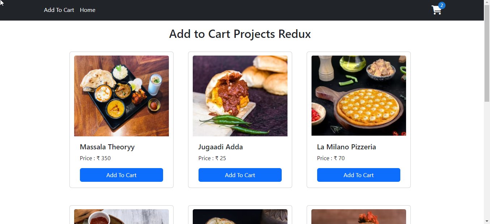

# Shoping Cart Redux Project

This project has been live at [Netlify](https://shoping-cart-add-redux.netlify.app/).

## Shoping App

This is a shoping app made with ReactJs and Redux, In this app user can add the product to the cart,able to increase and decrease the quantity as well. React-BootStrap and Material-UI is used for UI design

 

